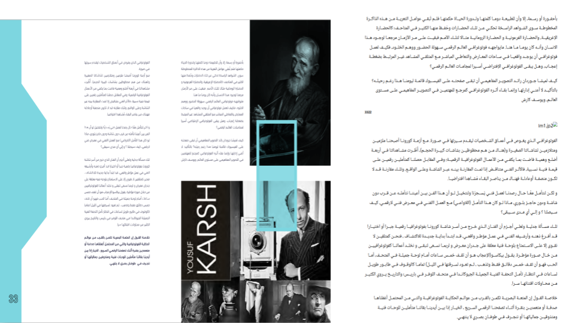
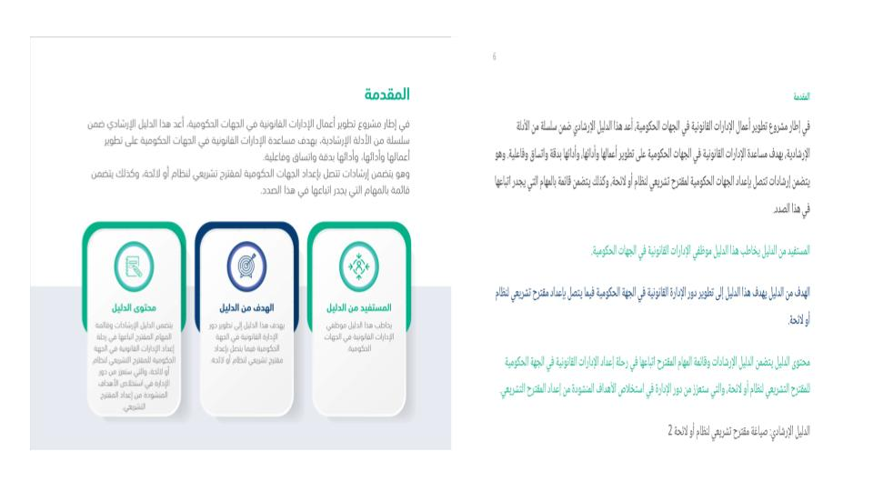
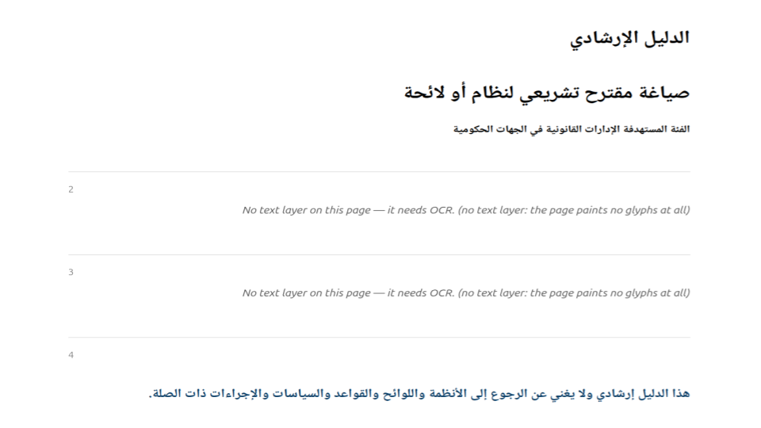
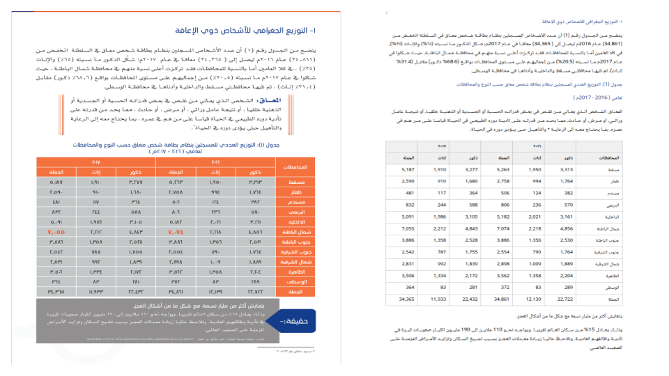

# The Arabic in your PDF is probably wrong

*And the worst part is that it looks fine.*

---

Here is a sentence from a Saudi government guidance document. It is boilerplate — the
disclaimer every such document carries:

<p lang="ar" dir="rtl">هذا الدليل إرشادي ولا يغني عن الرجوع إلى الأنظمة واللوائح</p>

> *"This guide is advisory and does not substitute for referring to the regulations and
> bylaws."*

Now here is what one of the most widely deployed PDF libraries in the world — pdfium, the
engine inside Chrome's PDF viewer — returns when you ask it to extract that line:

<p lang="ar" dir="rtl">إلى الرجوع عن يغني ولا إرشادي الدليل هذا</p>

Every word is intact. Every word is in the wrong place. The sentence has been turned back to
front, and if you don't read Arabic there is nothing about the output that says so — no error,
no warning, no exception. It is a well-formed Unicode string of correctly spelled Arabic words.
It just doesn't mean anything.

This article is about why that happens, about four other failures like it, and about the one
that I think is genuinely dangerous: the failure that returns no text at all and doesn't
mention it.

<figure>
  
  <figcaption>The original page on the left, <code>doc.to_html()</code> on the right. Photo
  captions, body text and pull quotes all land in the order a reader would take them, and the
  right-to-left flow survives into the rendered output. The one broken image is honest rather
  than hidden: it is JPEG 2000, which qalam does not decode, so it is reported through
  <code>unsupported_reason</code> instead of being silently dropped.</figcaption>
</figure>

---

## A PDF does not contain text

This is the root of all of it, and it surprises people who have never had to look.

A PDF does not store a document. It stores drawing instructions. When you open a file and see
a paragraph, what the file actually said was something closer to: *set font 12 to scale
20.55, move to coordinate (118.66, 476.77), paint glyph #276, paint glyph #164, paint glyph
#013.*

Glyph numbers, not letters. Positions, not lines. There is no paragraph in there. There are no
words. There is not even, necessarily, a space — many producers represent a space by simply
moving the cursor, so the gap between two words can be an absence rather than a character.

Getting text back out is an *inverse problem*: you are reconstructing an input from its
rendered output, and the information you need has been partly thrown away. Specifically, three
things you would want are all optional in the format:

- **The map from glyph number back to Unicode** (`/ToUnicode`). May be absent. May be wrong.
- **The logical structure** — which text is a heading, which cells form a table (`/StructTreeRoot`).
  Present only in "tagged" PDFs, which are a small minority of what exists in the world.
- **The reading order.** Never stored at all in an untagged file. It has to be inferred from
  where things sit on the page.

For English, the naive approach — decode each glyph, stick them together in the order they
appear in the file — works often enough that its failures look like edge cases you can ignore.

For Arabic it fails systematically, because Arabic manages to hit every weak point in that
list simultaneously.

---

## Five ways it breaks

### 1. The words come out backwards

Arabic is written right to left. PDF paints glyphs left to right, in *visual* order. So an
Arabic word is laid down starting from its last letter, and a naive reader that concatenates
in painting order gets every word reversed — and then, at the line level, every word in the
wrong position.

That's the pdfium example above. Fixing it means running the Unicode Bidirectional Algorithm
(UAX #9) backwards: from visual order back to logical order. And it means running it on
*positioned glyphs*, not on a string, because by the time you have a string the damage is done.

This is the one failure a user genuinely cannot repair afterwards. Once the glyphs have been
flattened into a string in the wrong sequence, the information needed to undo it — where each
glyph was on the page — is gone.

<div class="compare">
  <div class="bad">
    <span class="label">pdfium</span>
    <p lang="ar" dir="rtl">إلى الرجوع عن يغني ولا إرشادي الدليل هذا</p>
  </div>
  <div class="good">
    <span class="label">qalam</span>
    <p lang="ar" dir="rtl">هذا الدليل إرشادي ولا يغني عن الرجوع إلى</p>
  </div>
</div>

### 2. The letters are the wrong letters

Arabic is cursive, and its letters change shape depending on where they sit in a word —
isolated, initial, medial, final. The letter *heh* is <span lang="ar">ه</span> alone,
<span lang="ar">هـ</span> at the start, <span lang="ar">ـهـ</span> in the middle.

Unicode has a block for these shaped variants — the Presentation Forms — and it exists
essentially for backwards compatibility with old systems. You are not supposed to store text
in it. But a great many PDF producers do exactly that, because the shaped glyph is what they
were drawing.

So extraction gives you this:

<div class="compare">
  <div class="bad">
    <span class="label">PyMuPDF, as returned</span>
    <p lang="ar" dir="rtl">ﺍﻟﺪﻟﻴﻞ ﺍﻹﺭﺷﺎﺩﻱ</p>
  </div>
  <div class="good">
    <span class="label">qalam</span>
    <p lang="ar" dir="rtl">الدليل الإرشادي</p>
  </div>
</div>

To a human those look nearly identical. To a computer they share not one single codepoint.
Your tokenizer will not match them. Your search index will not find them. Your embeddings will
be garbage. In one 44-page document we counted **31,080** presentation-form characters in the
output of a popular library.

This one is at least fixable by the caller — `unicodedata.normalize("NFKC", text)` folds most
of them back. Which brings us to the trap.

### 3. Fixing #2 breaks #1

Some Arabic letter pairs are drawn as a single glyph. The commonest is *lam-alef*
(<span lang="ar">لا</span>): one glyph, two letters.

Normalization expands that glyph into its two letters. Reordering reverses the sequence. And
**the order in which you do those two operations changes the answer.**

Normalize first, and you now have two separate characters where you had one glyph — so when
you reverse, they swap. <span lang="ar">ولا</span> ("and not") becomes
<span lang="ar">وال</span> ("and the"). Both are real Arabic. One of them is a different word.
The sentence still reads as fluent text; it has simply been altered.

Reorder *first*, while the ligature is still one indivisible glyph, and it survives the
reversal untouched. Normalize afterwards and it expands in the right place.

> **The whole rule is: reorder, then normalize.** Almost everything else in this project
> follows from getting that order right and applying it consistently.

This generalizes further than the lam-alef. Some fonts map one glyph number to several letters
directly — we found fourteen such codes in one file, mapping to <span lang="ar">لم</span>,
<span lang="ar">لج</span>, <span lang="ar">بح</span>, <span lang="ar">في</span>,
<span lang="ar">هم</span>, <span lang="ar">لله</span>. Those sequences are *already* in reading
order, and a reversal that reaches inside them corrupts the word:
<span lang="ar">المعظم</span> comes back as <span lang="ar">املعظم</span>. So the rule becomes:
a multi-character mapping is an **atom**, and the reversal operates on atoms, never inside
them.

### 4. The vowel marks drift

Arabic can carry diacritics — tashkeel — that mark short vowels and doubled consonants. They
are combining characters, drawn above and below the letter they belong to.

Two separate bugs attack them, and both are silent.

The first is that they are painted at a horizontal position *inside* their base letter. Sort
glyphs left to right and the mark lands after its base; reverse the line and it lands before
it — attached to the wrong letter.

The second is stranger. `NFKC` of an isolated mark-bearing form emits a **literal space**
before the mark, because Unicode gives an isolated diacritic a space to sit on for display
purposes. In extracted text the mark is never isolated — it belongs to the letter beside it —
so normalization inserts a space into the middle of a word.

Here is one word, <span lang="ar">تتضمَّن</span>, through three tools:

<div class="compare">
  <div class="bad">
    <span class="label">pdfium</span>
    <p lang="ar" dir="rtl">تتضم ً ن</p>
  </div>
  <div class="bad">
    <span class="label">PyMuPDF + NFKC</span>
    <p lang="ar" dir="rtl">تتضم َّن</p>
  </div>
  <div class="good">
    <span class="label">qalam</span>
    <p lang="ar" dir="rtl">تتضمَّن</p>
  </div>
</div>

Note the middle one carefully — that is a space in the middle of the word. And it is not
PyMuPDF's fault: it placed the marks correctly and the space arrived when the caller
normalized. **Any tool that normalizes naively inherits this bug**, which is why it is worth
naming rather than scoring as a win.

### 5. The columns interleave

None of the above involves a single glyph decoding wrong. This one doesn't either, and it may
be the most destructive.

Text on a page is a set of coordinates. To produce a reading order you group glyphs into lines
by their vertical position — which is exactly right on a single-column page, and catastrophic
on a page with three columns side by side. You take one fragment from each column per line and
interleave three unrelated paragraphs into nonsense. Every character decoded perfectly. The
result is unreadable.

<figure>
  
  <figcaption>The page that forced this whole stage to exist. A full-width intro paragraph sits
  above three side-by-side cards, so an x-projection over the <em>whole</em> page finds no
  vertical gutter at all and a single global column pass detects zero columns. Only the
  recursion — having first cut the intro away on the horizontal gap — exposes the gutters
  underneath. Each card comes out whole, right to left. Grouping by baseline instead would have
  interleaved all three into nonsense.</figcaption>
</figure>

The fix is a recursive XY-cut: find the widest empty band on the page, split there, and
recurse into both halves. Because you always split at the *widest* gap, a full-width heading
gets removed before you go looking for the columns beneath it  no explicit "is this a
heading" rule is needed. Two details that took real documents to learn: thresholds have to
scale with the local type size (a 20 pt gap is a column gutter in 9 pt text and ordinary word
spacing at 40 pt), and column direction is a property of the **page**, not the line, so a
column of Latin figures can't flip the page's reading order.

---

## The failure that returns no error

Every problem so far is at least *visible* to someone who reads Arabic. Here is one that
isn't visible to anyone.

Sometimes a PDF has no usable text layer. It is a scan — pictures of pages, no glyphs at all.
Or its fonts carry no `/ToUnicode` map, so the glyph numbers cannot be turned back into
characters by any amount of parsing. Either way, there is no text to extract.

Ask any mainstream extractor for that page and you get back:

```
""
```

Ask it for a page that is genuinely blank — a section divider, the back of a cover — and you
get back:

```
""
```

**These are the same answer.** There is no flag, no exception, no field you can check. And
this is the normal case, not an exotic one: in our 44-page test document, four pages are
unrecoverable. pdfium returns empty for all four. PyMuPDF returns empty for all four. Neither
mentions it.

Now scale that up. You run ten thousand documents through a pipeline to build a corpus. Some
percentage of pages are scanned. Those pages are silently dropped, your job reports complete
success, and the damage is invisible — not just at ingestion, but forever, because nothing
downstream can distinguish "this document didn't discuss that topic" from "we lost page 12."

I think this is the real bug in PDF extraction, and it isn't an accuracy problem. It's an
honesty problem.

### So say something

Every page qalam extracts carries a verdict:

| verdict | meaning |
|---|---|
| `ok` | Every glyph resolved. The text can be trusted. |
| `degraded` | Text came out, but something is wrong. Here are the reasons. |
| `needs_ocr` | There is no usable text layer. Emitting the text would be worse than useless. |

```python
import qalam

doc = qalam.Document("report.pdf")

print(doc.confidence)         # 0.91
print(doc.pages_needing_ocr)  # [2, 3, 42, 43]   <- hand these to an OCR engine

for page in doc:
    if page.verdict != "ok":
        print(page.number, page.reasons)
        # 17 ['3 of 1841 glyph codes unresolved']
        # 42 ['no text layer: the page paints no glyphs at all']
```

<figure>
  
  <figcaption>Pages 2 and 3 of this document have no text layer. Every other extractor returns
  <code>""</code> for them — identical to what it returns for a blank page. qalam names them
  instead: <em>"no text layer: the page paints no glyphs at all."</em> That sentence is the
  difference between a corpus with a known gap and a corpus with an invisible one.</figcaption>
</figure>

Two decisions inside that scoring are worth stating, because both are the opposite of what
you'd write first.

**`ok` requires that *everything* resolved — a 99.9% success rate is `degraded`.** Every
unresolved glyph is a character missing from the output. A tolerance there would let real
losses pass as clean, which is the exact failure the project exists to prevent.

**A page with no glyphs scores 0.0, not 1.0.** The natural metric is "what fraction of glyphs
resolved successfully?" On a scanned page, zero glyphs are painted, zero fail, and that metric
returns a *perfect score*. It confidently certifies the one page you most needed it to flag.
"Nothing failed" is not "everything worked."

---

## Beyond characters: tables

Getting the letters right is the floor. Most of the documents people actually want — budgets,
statistical yearbooks, financial statements — are mostly tables, and a table flattened into a
line of text has lost the thing that made it a table.

<figure>
  
  <figcaption>A governorate statistics table, original on the left and reconstructed on the
  right: fourteen rows and seven columns survive as a grid rather than as a stream of loose
  numbers. Column 0 is the <em>rightmost</em> one, because that is where an Arabic reader
  starts — so <code>table.to_rows()</code> goes straight to <code>csv.writer</code>.</figcaption>
</figure>

Two findings here were worth the trouble.

**Geometry cannot decide what is a table.** A rounded frame drawn twice — one copy offset
behind the other as a drop shadow — produces four horizontal rules and four vertical ones,
every one spanning the full extent. That is geometrically indistinguishable from a 3×3 grid,
and reading it as one shreds a paragraph into empty cells. What separates a table from a frame
isn't where the lines are, it's what's inside: a real table fills most of its cells. So the
rejection has to happen *after* the text is placed, not during detection.

**Some tables have no lines at all.** A financial report in our corpus holds six columns held
together by alignment alone. The trick that works is letting the rows vote: each row votes only
across its own extent, and a position becomes a column boundary when most of the rows crossing
it leave it clear. A title or a section heading that spans the full width then can't hide the
columns underneath it.

Throughout, the bias is deliberate and one-directional: **a false table is worse than a missed
one.** Missing a table leaves text merely unstructured. Inventing one destroys it. So the bar
for an inferred table sits at four columns — two columns of prose with a badge between them
look exactly like a table geometrically, and the only thing distinguishing them is that one is
wrapped prose, which is a fact about language rather than about ink. The cost is stated rather
than hidden: a genuine three-column borderless table gets missed.

---

## What it looks like to use

```python
import qalam

text = qalam.extract_text("guide.pdf")
```

That's the whole simple case. Pages with no usable text layer contribute nothing — a scanned
page never masquerades as a result.

When you want structure, a page is an ordered list of typed blocks:

```python
for block in qalam.Document("guide.pdf").page(6).blocks:
    if block.kind == "table":
        for row in block.to_rows():
            print(row)
    elif block.kind == "image":
        block.save(block.file_name)
    else:
        print(block.text)
```

Flat text and structured blocks are the same data — `page.text` is *defined* as the
concatenation of the blocks — so the two views cannot drift apart.

There is also an HTML export, which reconstructs reading order, headings, colour and RTL
tables into one self-contained file:


It's a Rust core with a Python binding — one `abi3` wheel per platform covers Python 3.9 and
up — and a CLI. On a 44-page document, extraction takes about 0.22 s, which is within 1.4× of
both tools it's more correct than. Speed was never the point, but it's not a sacrifice either.

---


## What it doesn't do

No OCR — scanned pages are *detected and reported*, not read. No PDF creation or editing. No
pixel-perfect layout reproduction; you get ordered typed blocks, not a visual clone.
Three-column borderless tables are missed by design. Soft-mask compositing isn't implemented,
so a logo whose entire shape lives in its transparency mask extracts byte-correctly and looks
blank — and says so, via a `dropped_transparency` flag.

And this is young software validated against a small corpus. **More Arabic PDFs is by far the
most valuable contribution** — especially ones that break something. Every rule described in
this article exists because a real document proved the previous rule wrong.

---

## Try it

```sh
pip install qalam
```

```python
import qalam
doc = qalam.Document("your-file.pdf")
print(doc.pages_needing_ocr)
```

The source is on [GitHub](https://github.com/misraj-ai/qalam/tree/main) under the MIT licence. The repository includes
the golden test corpus, the comparison harness against pdfium and PyMuPDF that produced the
numbers here, and a design document with a **findings log** — a chronological record of what
each real document taught us, including several bugs that produced correct-looking, wrong
output.

That log is published deliberately. The failures turned out to be more instructive than the
design.
